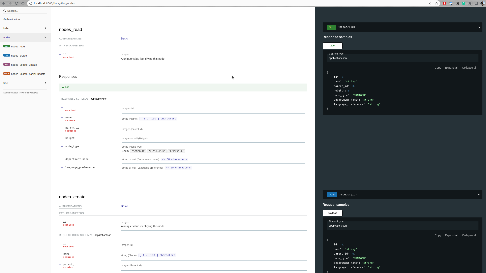

# Introduction
This is the backend of the Veo Assignment implemented using Django Framework .

## Assumptions
1. No authentication/authorazation is required for the API.
2. A default tree is already present in the database.
3. A root node does not have any parent.
4. Only one root node is present in the database.
5. The methods implemented for the tree are not optimized for performance and work on the assumption that the tree is not too large.
6. 16 test cases are written for the API but it may not cover all the cases.
7. The docs are auto generated using drf-yasg. You can find them at http://localhost:8000/docs

## Technologies Used
* Django
* Python
* Django Rest Framework
* drf-yasg
* corseheaders
* db.sqlite3
* docker

## Installation
You need to have a python environment (or just plain python) with python 3.10 installed on your system. 
```
pip install -r requirements.txt
```

## Running the server


After the installation 

In the project directory, you can run:
```
python manage.py runserver
```


Runs the app in the development mode.\
Open [http://localhost:8000/api/v1/tree](http://localhost:8000/api/v1/tree) to view it in the browser.

The page will reload if you make edits.\
You will also see any lint errors in the console.

### Available Endpoints
* **/api/v1/tree/** - GET - Returns the tree in JSON format
* **/api/v1/nodes/{id}** - GET, POST - Returns the node with the given id in JSON format. POST request can be used to create a new node with a parent with id={id}.
* **/api/v1/nodes/{id}/update** - PATCH - Updates the node with the given id. The request body should contain the parent_id to update the parent of the current node ({id}).


## To-Do
* more test cases
* add more features (if we have time)

## Screenshots

### Docs


### Tree View


### Get Create Node


### Update Node
