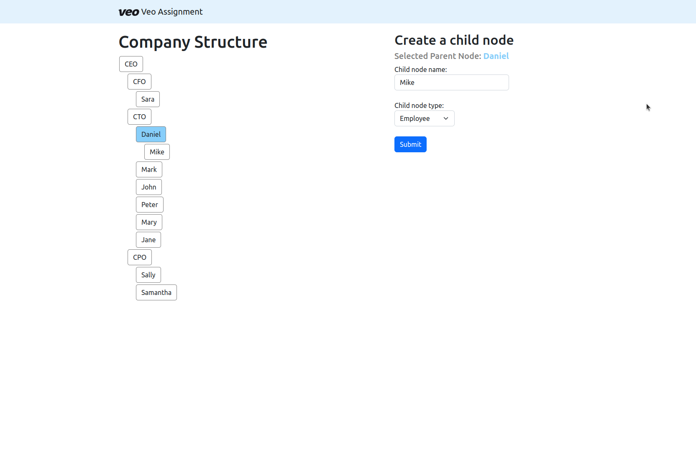
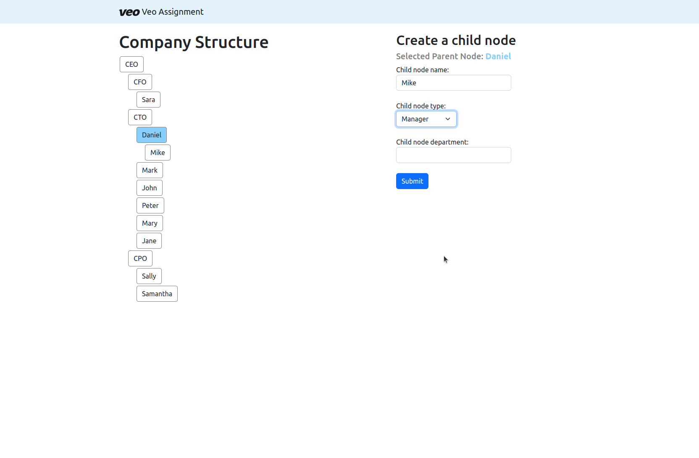

# Introduction
This is the visualization app of the Veo Assignment implemented using React (typescript).
I wanted to test at least some components but I didn't have time since I already used 6 days.
Maybe I will add some after the submission

## Assumptions
1. The frontend assumes that at least one node already exists in the database 
2. The tree is small otherwise it won't fit in the screen. 
3. The only operation that can be done besides displaying the company tree 
is to create a node after you have selected a node. 
4. This ui app is not well tested. 


## Technologies Used
* React
* Typescript
* React-query
* bootstrap
* Node 18
* npm
* docker

## Installation
You can just simply run:

```
npm run ci
```

## Available Scripts

After the installation 

In the project directory, you can run:

```
 npm start
```

Runs the app in the development mode.\
Open [http://localhost:3005](http://localhost:3005) to view it in the browser.

The page will reload if you make edits.\
You will also see any lint errors in the console.


## To-Do
* tests 
* add more features (if we have time)

## Screenshots
### Tree View


### Tree View with Manager 

